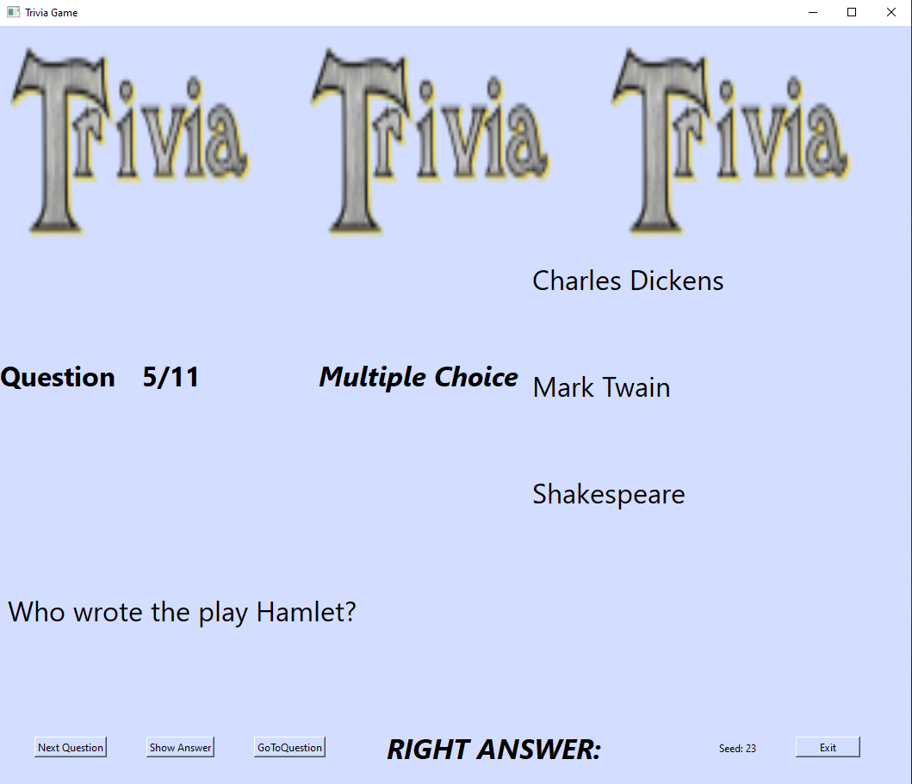

# Custom Trivia Game Creator Package

Package to create your own customized trivia game and display with a simple graphical user interface.

Welcome to the custom Trivia Game Creator Package! This Python package is designed to provide a fast and easy way to create your own customized trivia game and a simple graphical user interface (GUI) is already prepared to create the interactive experience. All the user has to prepare is an Excel sheet with questions and a JSON file to describe which columns of the Excel sheet describe the trivia questions. The input data format is explained more detailed in [The input data format](#the-input-data-format) section. The package is developed and tested on the Windows operating system.

Below shows an example where a *Multiple Choice* question displayed on the GUI. The game is playable through `Next Question`, `Show Answer`, and `GoToQuestion` buttons. Clicking `Show Answer` button will display the right answer for the current question.



***Motivation behind this package:***
Being inspired by my favourite TV series [`Friends`](https://en.wikipedia.org/wiki/Friends) (specifically the twelfth episode of the fourth season called [*"The One With the Embryos"*](https://www.imdb.com/title/tt0583600/)), I have decided to create a custom trivia quiz game to play with my friends and have a fun evening. Some of the features being present in that game are removed to keep our personal information private, and this package is created using the base code of the game.

## Installation

### Prerequisites

- Python 3.x installed on your system.

### Installation steps

1. Clone this repository to your local machine:

   ```bash
   git clone https://github.com/AlpSari/trivia-game-creator.git trivia_game_creator
   cd trivia_game_creator
   ```

2. (Optional) Create a Python virtual environment and activate it:

    ```bash
      python -m venv venv
    ```

    For Windows, activate the virtual environment by:

    ```bash
    ./venv/Scripts/activate
    ```

3. Install the required dependencies using pip:

    ```bash
    pip install -r requirements.txt
    ```

4. (Optional) Install developer tools if you would like to contribute to the project:

    ```bash
    pip install -r dev_requirements.txt
    ```

    Additional to the `linters` etc. defined in the `dev_requirements`, I found it useful to install `pyqt6-tools`, to develop / modify the GUI located in `trivia_game/trivia_game.ui`. After installing `pyqt6-tools` (which can be installed by pip via `pip install pyqt6-tools`), the designer app can be launched using:

    ```bash
    pyqt6-tools designer
    ```

### Running the example trivia game

To test if the installation is succesful and to illustrate the example input data format, an example game data is put to the root of the repository. Run the example game by running the `main.py` with `--launch-example-game` option.

```bash
python -m main --launch-example-game
```

if you encounter import problems, try running

```bash
python main.py --launch-example-game
```

## Creating your custom trivia game

### The input data format

In order to make and play a custom trivia game, one would need 2 files:

1. An Excel file (i.e., a file with `.xlsx` extension) which contains the questions and the answers of the trivia game,
2. A JSON file (i.e., `.json`) file to describe the custom game to the engine, such that the data from the Excel is loaded correctly.

The expected dataset format is an Excel sheet (`.xlsx` file) where one column shows the question categories, and the rest of the columns are used to store the `question`, `answer`, and `additional text` required for the question. Those terms are explained by the example below:

For example, a **"Multiple Choice"** type question would require the main question (i.e., `question`), some options to choose from (i.e., `additional text`) and the right answer (i.e., `answer`). On the other hand, a **True-False** type of question would only require the question (i.e., `question`), and the answer (i.e., `answer`).

For an example, with a game with two categories, **"Multiple Choice"** and **"True-False"** as defined above, the excel sheet would expected to look like below:
| Question Category       | Question                                | Answer                   | MC-A             | MC-B|MC-C|
| -------------- | --------------------------------------- | ------------------------ | -----------------|-----|-----|
| Multiple Choice| What is the capital of France?          | Paris                    | London| Berlin | Paris
| True-False     | The moon orbits the Earth.              | True                     | |
| Multiple Choice| Who painted the Mona Lisa?              | Leonardo da Vinci        | Michelangelo | Picasso | Leonardo da Vinci |

where the corresponding JSON file is:

```json
{
  "Question Category": {
    "Multiple Choice": {
        "question": "Question",
        "answer": "Answer",
        "additional text": [
            "MC-A", "MC-B", "MC-C"
        ]
    },
    "True-False": {
        "question": "Question",
        "answer": "Answer",
        "additional text": []
    }
  }
}
```

or such a version is also acceptable:

| Question Category v2      | MC Question                                |TF Question| MC Answer | TF Answer|MC-A| MC-B|MC-C|
|--|--|--|--|--|--|--|--|
| Multiple Choice| What is the capital of France?          | |Paris                    | |London| Berlin | Paris
| True-False     |               | The moon orbits the Earth.|                     | True||
| Multiple Choice| Who painted the Mona Lisa?              | |Leonardo da Vinci        | |Michelangelo | Picasso | Leonardo da Vinci |

where the corresponding JSON file is:

```json
{
  "Question Category v2": {
    "Multiple Choice": {
        "question": "MC Question",
        "answer": "MC Answer",
        "additional text": {
            "MC-A", "MC-B", "MC-C"
        }
    },
    "True-False": {
        "question": "TF Question",
        "answer": "TF Answer",
    }
  }
}
```

The code parses the excel file into question categories by selecting the rows by the provided question category column name, and the relevant columns are selected which are described in the `question`, `answer` and the `additional text` keys. Thus, same columns between different question categories can be shared.

**Note:** The dataloader is not robust to small discrepancies between the keys/values given in the JSON file and the column names and the question type strings given in the Excel file. Thus, in order to reduce the risk of dataloader-related errors, try to provide the exact strings (noting whitespace etc) for the Excel and JSON file.

**Note:** Currently up to **5** different `additional text` (columns) can be supported by the GUI. Also, `additional text` is optional in the provided JSON file for question types which do not need it defined.

### Playing the Game

Ensure you have your dataset of questions ready in the specified format. Assuming the Excel and the JSON file are in the root with names `dataset.xlsx` and the `game_description.json`, run the game using the following command:

```bash
python -m main --questions-excel-path dataset.xlsx --game-description-json-path game_description.json
```

or if you encounter any import problems, try

```bash
python main.py --questions-excel-path dataset.xlsx --game-description-json-path game_description.json
```

Additionally, command line logging statements using `logging` package can be enabled using the `--logging-level` argument.

## Testing

Unit tests for the package are available in the `tests/` directory. To run the tests, use the following command:

```bash
python -m unittest discover -s tests
```

Note that the GUI-related tests were causing *SegmentationFault*, which are not debugged yet so those tests are commented out for now.
